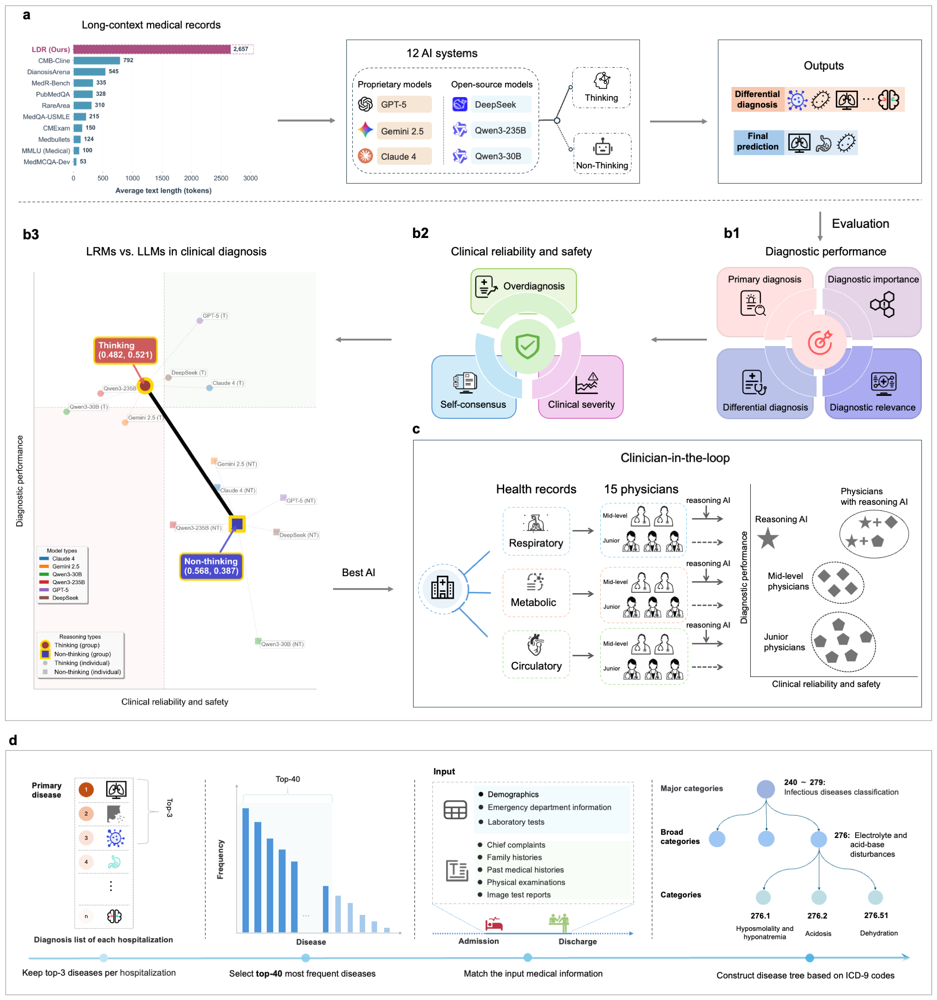

# The reasoning paradox of large language models in clinical diagnostics

This is an official implementation of "[The reasoning paradox of large language models in clinical diagnostics]()".

## Introduction

This study constructed two long-context diagnostic reasoning (LDR) benchmarks using the MIMIC-IV and eICU databases to evaluate six state-of-the-art matched model pairs: GPT-5 (Mini), Gemini 2.5 (Flash), Claude 4 (Sonnet), DeepSeek, Qwen3-235B, and Qwen3-30B. Each pair comprises a thinking-augmented model (referred to as LRM) and a standard model (LLM), both operating on the identical base model.
Our evaluation framework assessed two complementary dimensions: diagnostic performance and clinical reliability/safety.
The results reveal a key insight: although LRMs achieve superior diagnostic accuracy and comprehensiveness, these benefits are counterbalanced by notable limitations in clinical reliability and safety, such as overdiagnosis and inconsistencies at the level of individual diagnoses.



> *Overview of model evaluation framework and LDR-MIMIC dataset construction pipeline*


## File Structure
Our code structure consists of three main parts: 
- Data processing: scripts for preparing and processing the MIMIC-IV dataset into the LDR benchmark.
- Inference code: scripts for model inference and evaluation via API.
- Examples: single-case inference to check case input and output; 100 cases from each dataset are provided for consistency reproduction.

The detailed structure of the code is as follows:

```
├── README.md
├── LICENSE
├── data/                # Dataset related (download scripts, preprocessing, example data)
│   ├── preprocess/      # Preprocessing MIMIC-IV dataset, integrating each patient's admission information
│   └── make_ldr/        # Scripts and workflow for constructing the LDR dataset
├── inference/           # Inference model code (model loading, inference scripts, evaluation)
└── examples/            # Example use cases, notebooks, etc.
```

## Data Preparation:

### Download:
To build LDR-MIMIC dataset, you need to download [the MIMIC-IV dataset ](https://physionet.org/content/mimiciv/2.2/) (requires passing a qualification exam).
Then use our code in the `data/` directory to process and generate the LDR training and evaluation datasets.

Similarly, to build the LDR-eICU dataset, you need to download [the eICU dataset](https://eicu-crd.mit.edu/).

### Processing:

To build the LDR-MIMIC dataset:

-  Use the scripts in the `data/preprocess_mimic` directory to process the raw MIMIC-IV data and organize all admission information for each patient.

- Run the scripts in `data/make_ldr_mimic` to construct the LDR- evaluation datasets.

To build the LDR-eICU dataset, follow the steps in the [build_pipeline](data/make_ldr_eicu/ldr_eicu_build.md).


## Inference API models
### 1. Requirements
To run inference, please install the required Python packages:

```bash
pip install openai requests
```

To perform inference with APIs (e.g., OpenAI, DeepSeek, and Claude), you must obtain and set your API keys. You can directly insert your API key in the code where required. 

We recommend using the third-party API platform -- [CursorAI](https://api.cursorai.art/), which allows access to all of the models with a single API key.


### 2. Inference Evaluation Data
As an example, to perform inference using the Claude 4 (Sonnet) model, follow these steps:

1. **Run Inference**  
  Use the provided shell script to generate predictions (add your **API key** in the script):
  ```bash
  bash ./inference/scripts/infer/infer_claude_sonnet_4.sh
  ```

2. **Extract Results**  
  After inference, extract and format the results:
  ```bash
  python process_data/extract_result.py
  ```

3. **Evaluate Predictions**  
  Evaluate the predictions using the evaluation script:
  ```bash
  bash ./inference/scripts/eval/eval_api_models/eval_claude_sonnot_4.sh
  ```

Replace the placeholder paths in the scripts with your actual prediction and reference files as needed.

## Examples

### One case testing:
**Inference with API Models**

Use the [`examples/inference_api.ipynb`](examples/inference_api.ipynb) notebook to perform inference with API models.

### One hundred cases for batch testing:

We provide 100 LDR-MIMIC test cases in `examples/ldr_dataset/mimic_llm_sample_100_subset.json` for consistency verification.

Additionally, 100  LDR-eICU dataset test cases are available in `examples/eicu_dataset/eicu_llm_sample_100_subset.json` for consistency verification.

After configuring your API KEY:

**Testing the LDR dataset**

1. You can run batch testing on the LDR dataset using `inference/scripts/infer/infer_gemini_2_5_flash.sh`.
2. Then, extract the inference results for each model and each round:
  ```
  python inference/ldr_process_data/extract_result.py model_xx_output.jsonl
  ```
3. Calculate repeat consistency:
  ```
  bash inference/scripts/eval/lanuch_consistency.sh
  ```
4. Compute metrics (note: metrics on only 100 cases may differ from those on the full dataset):
  ```
  bash inference/scripts/eval/eval_api_models/eval_gemini_2_5_flash.sh
  ```

**Testing the external eICU dataset**

1. Run testing using `inference/scripts_eicu/infer/infer_gemini_2_5_flash.sh`.
2. Then, extract the inference results for each model and each round:
  ```
  python inference/eicu_eval/extract_eicu_results.py model_xx_output.jsonl
  ```
3. Calculate repeat consistency:
  ```
  bash inference/scripts_eicu/eval/lanuch_consistency.sh
  ```
4. Compute metrics (note: metrics on only 100 cases may differ from those on the full dataset):
  ```
  bash inference/scripts_eicu/eval/eval_gemini_2_5_flash.sh
  ```

<!-- # Citation
If you find this project useful for your research, please consider citing:
```
@inproceedings{shuai2025MedLDR,
  title={Uncovering the Limits of Reasoning Large Language Models in Medical Diagnostics},
  author={Hongyu Zhuo, Shuai Wu, Meng Lou, Yizhou Yu},
  booktitle={},
  year={2025}
}
``` -->

# Acknowledgment
Our implementation is mainly based on the following codebases. We gratefully thank the authors for their wonderful works.
> [DeepSeek-R1](https://github.com/deepseek-ai/DeepSeek-R1)

# Contact

If you have any questions, please feel free to [create issues]()❓ or [contact me](u3010415@connect.hku.hk) 📧