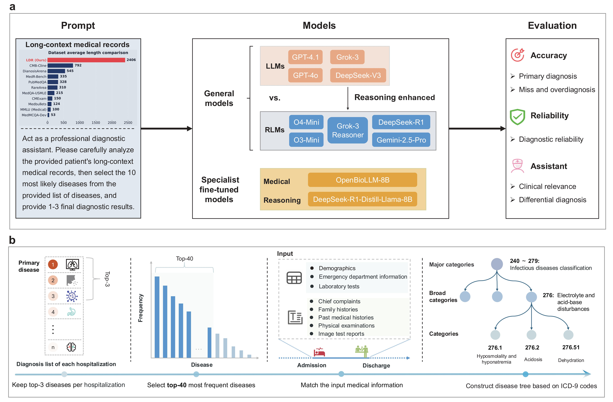

# The reasoning paradox of large language models in clinical diagnostics

This is an official implementation of "[The reasoning paradox of large language models in clinical diagnostics]()".

## Introduction

We constructed a long-context diagnostic reasoning (LDR) benchmark from the MIMIC-IV database. We systematically evaluated 5 state-of-the-art reasoning language models (RLMs) including Gemini-2.5-Pro, O4-Mini (High), O3-Mini (High), DeepSeek-R1, and Grok-3-Reasoner, along with 4 large language models including GPT-4.1, GPT-4o, DeepSeek-V3, and Grok-3. Our evaluation framework spans 3 dimensions (Accuracy, Reliability, Assistance) using 5 metrics: primary accuracy, exact match accuracy, miss and overdiagnosis rates, diagnostic reliability, and quality of differential diagnosis and clinical relevance.



> *Overview of model evaluation framework and LDR dataset construction pipeline*

**Key Findings**

- Our study reveals RLMs outperform LLMs in primary diagnoses (61.8% vs 52.5% accuracy), but still fall below clinical deployment thresholds.
- Even the best models achieve less than 25% exact match accuracy, with RLMs showing 43% higher overdiagnosis rates despite better identifying relevant conditions. We further analyzed three main causes of overdiagnosis: evidence over-interpretation errors (Type-A), temporal confusion (Type-B), and clinical hierarchy confusion (Type-C), with Type-A and Type-C being the most significant contributors.
- RLMs demonstrate lower reliability, with 62% primary self-consistency compared to LLMs' 87%, suggesting reasoning introduces variability.
- As diagnostic assistants, RLMs provide superior differential diagnoses and higher clinical relevance, with only 29.2% completely unrelated predictions versus 37.6% for LLMs.
- All evaluated models still produce 30%+ clinically irrelevant predictions, indicating significant room for improvement before clinical deployment.


## Data:

First, you need to download [the MIMIC-IV dataset ](https://physionet.org/content/mimiciv/2.2/) (requires passing a qualification exam).
Then use our code in the `data/` directory to process and generate the LDR training and evaluation datasets.


## File Structure
Our code structure consists of three main parts: 
- Data processing: scripts for preparing and processing the MIMIC-IV dataset into the LDR benchmark.
- Inference code: scripts for model inference and evaluation via API.
- Fine-tuning code: scripts for model fine-tuning on the LDR training set.

The detailed structure of the code is as follows:

```
├── README.md
├── LICENSE
├── data/                # Dataset related (download scripts, preprocessing, example data)
│   ├── preprocess/      # Preprocessing MIMIC-IV dataset, integrating each patient's admission information
│   └── make_ldr/        # Scripts and workflow for constructing the LDR dataset
├── inference/           # Inference model code (model loading, inference scripts, evaluation)
├── finetune/            # Fine-tuning code (training scripts, configs, logs)
├── models/              # Pre-trained/fine-tuned model weights (optional, or download links)
└── examples/            # Example use cases, notebooks, etc.
```

## Inference API models
### 1. Requirements
To run inference, please install the required Python packages:

```bash
pip install openai requests
```

To perform inference with APIs (e.g., OpenAI, DeepSeek), you must obtain and set your API keys. You can directly insert your API key in the code where required.

### 2. Data Preparation
- First, download the [MIMIC-IV](https://physionet.org/content/mimiciv/2.2/) dataset from PhysioNet (requires credential approval).

- Next, use the scripts in the `data/preprocess` directory to process the raw MIMIC-IV data and organize all admission information for each patient.

- Finally, run the scripts in `data/make_ldr` to construct the LDR training and evaluation datasets.

### 3. Inference Evaluation Data
As an example, to perform inference using the DeepSeek-R1 model, follow these steps:

1. **Run Inference**  
  Use the provided shell script to generate predictions:
  ```bash
  bash ./inference/scripts/infer/infer_deepseek_r1.sh
  ```

2. **Extract Results**  
  After inference, extract and format the results:
  ```bash
  python process_data/extract_result.py
  ```

3. **Evaluate Predictions**  
  Evaluate the predictions using the evaluation script:
  ```bash
  bash ./inference/scripts/eval/eval_api_models/eval_deepseek_r1_metrics.sh
  ```

Replace the placeholder paths in the scripts with your actual prediction and reference files as needed.


##  Fine-tuning models
### 1. Requirements
**Model Preparation**
Download the models from the links provided in `models/download_link.txt`:
- [DeepSeek-R1-Distill-Llama-8B](https://huggingface.co/deepseek-ai/DeepSeek-R1-Distill-Llama-8B)
- [Llama3-OpenBioLLM-8B](https://huggingface.co/aaditya/Llama3-OpenBioLLM-8B)

**Training Environment**
Our training code is based on [open-r1](https://github.com/huggingface/open-r). Please set up your environment according to the requirements of open-r1.

### 2. Data Preparation

Use the training dataset of the LDR dataset.

### 3. Train

**Supervised Fine-tuning Training**

- Train DeepSeek-R1-Distill-Llama-8B
```
bash ./finetune/scripts_train/distill_llama_8b/sft/train_sft_llama_8b_mimic.sh
```
- Train Llama3-OpenBioLLM-8B
```
bash ./finetune/scripts_train/distill_llama_8b/grpo/train_grpo_llama_8b.sh
```

**Reinforcement Learning Training (GPRO)**
- Train DeepSeek-R1-Distill-Llama-8B
```
bash ./finetune/scripts_train/openbio_8b/sft/train_sft_openbio_8b_mimic.sh
```
### 4. Inference Evaluation Data

1. **Run Inference**  
  Use the provided shell script to generate predictions:
  ```bash
  # Inference SFT models
  bash ./finetune/scripts_infer/distill_llama_8b/infer_sft_distill_llama_api_data.sh
  # Inference RL models
  bash ./finetune/scripts_infer/distill_llama_8b/infer_grpo_distill_llama_8b_model.sh
  ```

2. **Extract Results**  
  After inference, extract and format the results:
  ```bash
  python finetune/eval/extract_sft_openbio_result.py
  ```

3. **Evaluate Predictions**  
  Evaluate the predictions using the evaluation script:
  ```bash
  bash ./inference/scripts/eval/eval_train_models/eval_sft_model.sh
  ```

## Examples

### One case testing:
**Inference with API Models**

Use the [`examples/inference_api.ipynb`](examples/inference_api.ipynb) notebook to perform inference with API models.

**Inference with Fine-tuned Models**

Use the [`examples/inference_ft.ipynb`](examples/inference_ft.ipynb) notebook to perform inference with fine-tuned models.

### One hundred cases for batch testing:

我们在 `examples/ldr_dataset/mimic_llm_sample_100_subset.json` 下提供了100 个 LDR 数据的测试案例。可以用于一致性的验证

还在 `examples/eicu_dataset/eicu_llm_sample_100_subset.json` 下提供了 100 个外部数据集 eICU 的测试案例以用于一致性的验证。

配置好 API KEY 后，

**测试 LDR 数据集**

1. 可以在 `inference/scripts/infer/infer_gemini_2_5_flash.sh` 对 LDR 数据一键开启测试。
2. 然后提取每个模型每轮的推理结果
```
python inference/ldr_process_data/extract_result.py model_xx_output.jsonl
```
3. 计算重复一致性
```
bash inference/scripts/eval/lanuch_consistency.sh
```
4. 计算指标 (仅100 个 case 的指标可能距离整体数据集指标有偏差)
```
bash inference/scripts/eval/eval_api_models/eval_gemini_2_5_flash.sh
```

**测试外部 eICU 数据集**
1. 在 `inference/scripts_eicu/infer/infer_gemini_2_5_flash.sh` 测试
2. 然后提取每个模型每轮的推理结果
```
python inference/eicu_eval/extract_eicu_results.py model_xx_output.jsonl
```
3. 计算重复一致性
```
bash inference/scripts_eicu/eval/lanuch_consistency.sh
```
4. 计算指标 (仅100 个 case 的指标可能距离整体数据集指标有偏差)
```
bash inference/scripts_eicu/eval/eval_gemini_2_5_flash.sh
```

<!-- # Citation
If you find this project useful for your research, please consider citing:
```
@inproceedings{shuai2025MedLDR,
  title={Uncovering the Limits of Reasoning Large Language Models in Medical Diagnostics},
  author={Hongyu Zhuo, Shuai Wu, Meng Lou, Yizhou Yu},
  booktitle={},
  year={2025}
}
``` -->

# Acknowledgment
Our implementation is mainly based on the following codebases. We gratefully thank the authors for their wonderful works.
> [Open-r1](https://github.com/huggingface/open-r1), [DeepSeek-R1](https://github.com/deepseek-ai/DeepSeek-R1)

# Contact

If you have any questions, please feel free to [create issues]()❓ or [contact me](u3010415@connect.hku.hk) 📧